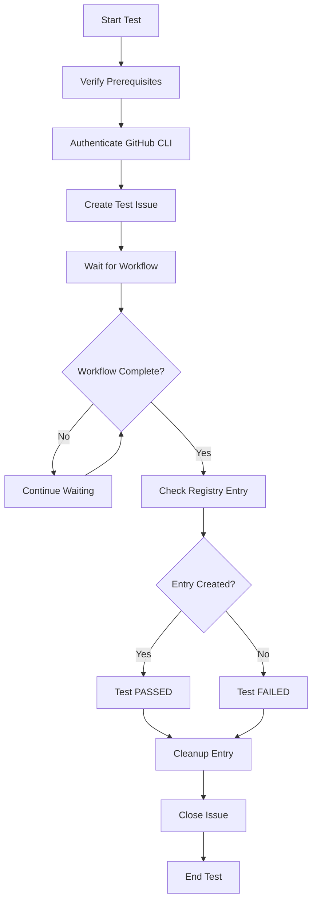

# MCP Workflow Test - Summary

## What Was Created

This test system validates the `issues-mcp.yml` GitHub Actions workflow by creating a complete end-to-end test that:

1. **Creates a test issue** with the required YAML format
2. **Monitors the workflow execution** 
3. **Validates the registry entry creation**
4. **Cleans up after itself**

## Directory Structure

```
test/mcp/
├── mcp.json                     # Fictional MCP server definition for testing
├── test-mcp-workflow.sh         # Main bash test script
├── test-mcp-workflow.ps1        # PowerShell wrapper script
├── verify-setup.sh              # Prerequisites verification script
├── README.md                    # Detailed documentation
└── SUMMARY.md                   # This summary file
```

## Test Components

### 1. MCP Definition File (`mcp.json`)
- **Purpose**: Provides a valid MCP server definition that the workflow can process
- **Content**: A complete MCP server specification with:
  - Name and description
  - Version information
  - Registry details (npm package)
  - Tool definitions
  - Environment variables
- **Location**: Points to `test/mcp/mcp.json` in the clemensv/xregistry-ai repository

### 2. Main Test Script (`test-mcp-workflow.sh`)
- **Purpose**: Orchestrates the complete test workflow
- **Features**:
  - Colored output for better readability
  - Error handling and validation
  - Configurable timeouts and settings
  - Automatic cleanup
  - Detailed logging

### 3. PowerShell Wrapper (`test-mcp-workflow.ps1`)
- **Purpose**: Provides Windows PowerShell users with a native interface
- **Features**:
  - Parameter validation
  - Help system
  - Prerequisite checking
  - Calls the bash script internally

### 4. Verification Script (`verify-setup.sh`)
- **Purpose**: Pre-flight check to ensure all dependencies are available
- **Checks**:
  - Required files exist
  - JSON validity
  - GitHub CLI availability
  - Script permissions
  - Git configuration
  - Repository setup

## Test Workflow



## How the Test Works

### Issue Creation
The script creates a GitHub issue with this YAML content:
```yaml
repo: clemensv/xregistry-ai
path: test/mcp
branch: main
mcpprovider: test-provider
server: test-server
```

### Workflow Processing
1. The `issues-mcp.yml` workflow is triggered by the issue creation
2. The workflow runs the `validate-submission.js` script
3. The script:
   - Parses the YAML from the issue
   - Fetches the `mcp.json` file from the specified repository path
   - Validates the content
   - Creates a registry entry at `registry/mcpproviders/test-provider/servers/test-server/index.json`
   - Commits and pushes the changes
   - Closes the issue with a success comment

### Test Validation
The test script:
- Monitors the issue state every 15 seconds
- Checks for the registry entry creation
- Validates the workflow completed successfully
- Reports success or failure

### Cleanup
After validation:
- Removes the created registry entry
- Ensures the test issue is properly closed
- Commits the cleanup changes

## Usage Examples

### Basic Usage (Bash)
```bash
# If already logged in with 'gh auth login'
./test/mcp/test-mcp-workflow.sh

# Or if using a token
export GITHUB_TOKEN=ghp_xxxxxxxxxxxx
./test/mcp/test-mcp-workflow.sh
```

### PowerShell Usage
```powershell
# If already logged in with 'gh auth login'
.\test\mcp\test-mcp-workflow.ps1

# Or if using a token
$env:GITHUB_TOKEN = "ghp_xxxxxxxxxxxx"
.\test\mcp\test-mcp-workflow.ps1
```

### With Verification
```bash
# Check setup first
./test/mcp/verify-setup.sh

# Run the test (no token needed if already authenticated)
./test/mcp/test-mcp-workflow.sh
```

## Expected Output

### Success Case
```
[INFO] Starting MCP workflow test...
[INFO] Repository: clemensv/xregistry-ai
[SUCCESS] GitHub CLI authenticated
[SUCCESS] Created issue #123
[INFO] Waiting for workflow to process issue #123...
[SUCCESS] Issue #123 has been closed
[SUCCESS] Registry entry created at: registry/mcpproviders/test-provider/servers/test-server/index.json
✅ MCP workflow test PASSED!
[SUCCESS] Removed registry entry
[SUCCESS] Test issue #123 handled
[INFO] Test completed
```

### Failure Case
```
[ERROR] Registry entry not found at: registry/mcpproviders/test-provider/servers/test-server/index.json
❌ MCP workflow test FAILED - Entry not created
[ERROR] Found error comment: ❌ YAML parsing error: Invalid format
```

## Configuration

The test can be configured by modifying variables in the scripts:

- `REPO_OWNER`: GitHub repository owner (default: "clemensv")
- `REPO_NAME`: Repository name (default: "xregistry-ai") 
- `TEST_PROVIDER`: Provider name for testing (default: "test-provider")
- `TEST_SERVER`: Server name for testing (default: "test-server")
- `max_wait`: Maximum wait time in seconds (default: 300)
- `check_interval`: Check interval in seconds (default: 15)

## Benefits

1. **Automated Validation**: Ensures the MCP workflow functions correctly
2. **CI/CD Integration**: Can be integrated into continuous integration pipelines
3. **Regression Testing**: Catches breaking changes to the workflow
4. **Documentation**: Serves as executable documentation of the workflow
5. **Self-Cleaning**: No manual cleanup required
6. **Cross-Platform**: Works on Windows (PowerShell), macOS, and Linux (bash)

## Future Enhancements

Potential improvements could include:

1. **Multiple Test Cases**: Test different MCP configurations
2. **Error Scenarios**: Test invalid YAML, missing files, etc.
3. **Performance Testing**: Measure workflow execution times
4. **Parallel Testing**: Run multiple tests simultaneously
5. **Integration with CI**: Automated testing on pull requests
6. **Notification System**: Alert on test failures 